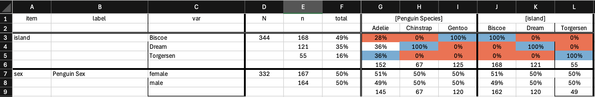

# Spreadview

R package for exporting data (usually) from opinion survey into a nicely readable MS Excel spreadsheet.
Based on data.table and openxlsx2. Supports categorical variables only for now.

Work in (very early) progress.

## Installation

Install from GitHub using [pak](https://pak.r-lib.org):

```r
pak::pak("alesvomacka/spreadview")
```

## Basic Use

You can create Excel spreadsheet using `compose_spreadsheet()` function:

```r

# Create fake survey weights for demonstration (optional)
penguins$survey_weight <- runif(nrow(penguins), min = 0.5, max = 1.5)
penguins$survey_weight <- penguins$survey_weight / mean(penguins$survey_weight)

# Tables will use variable labels if present
attr(penguins$species, "label") <- "Penguin Species"
attr(penguins$sex, "label") <- "Penguin Sex"

#Helper function to select categorical columns from data frame (optionally exclude unwanted ones)
categorical_vars <- get_categerical_vars(penguins, exclude = "species")

# Column names for grouping variables
group_vars <- c("species", "island")

#Export spreadsheet in xlsx format (weights are optional)
compose_spreadsheet(data = penguins,
          vars = categorical_vars,
          group = group_vars,
          weight = "survey_weight",
          file = "penguins-table.xlsx")
```

The output:


